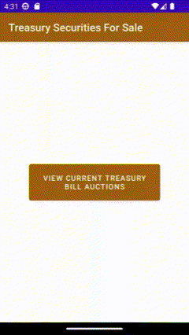

# investing-guide

# versions
|      Version 6            |     Version 5            |      Version 4            |
|---------------------------|--------------------------|---------------------------|
|   |  |   |

|      Version 3            |      Version 2            |       Version 1           |  
|---------------------------|---------------------------|---------------------------|
|   |   |   | 

Android app that helps see what treasury security bills are available for sale.  
It shows the different securities and the following fields :  
- `securityType`
- `CUSIP`
- `issueDate`
- `pricePer100`

# Install
Import the `investingguideandroidui` into android studio and run the `MainActivity` class.
The emulator should show a list of securities available for the last 3 days.

Please fork the project and add new functionalities
